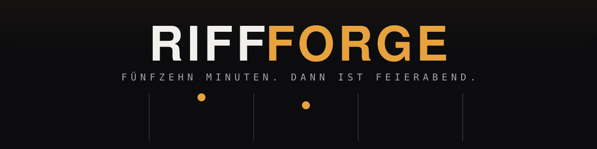
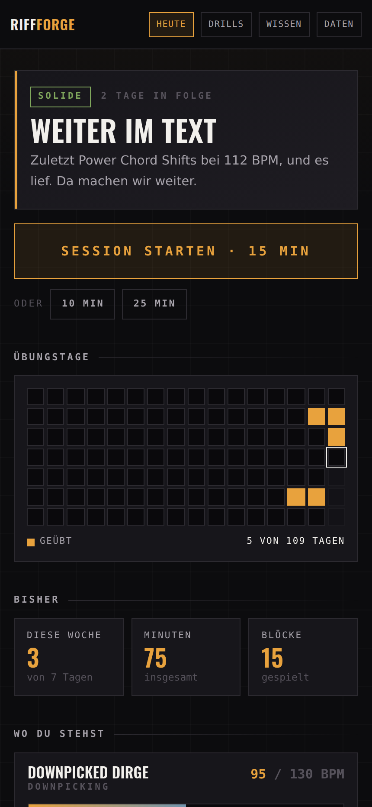
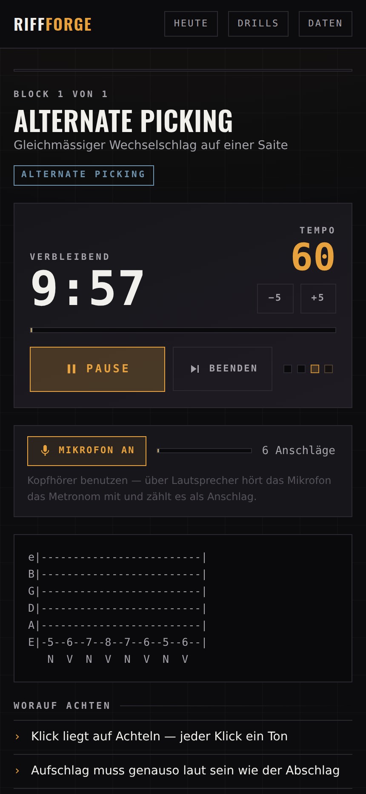
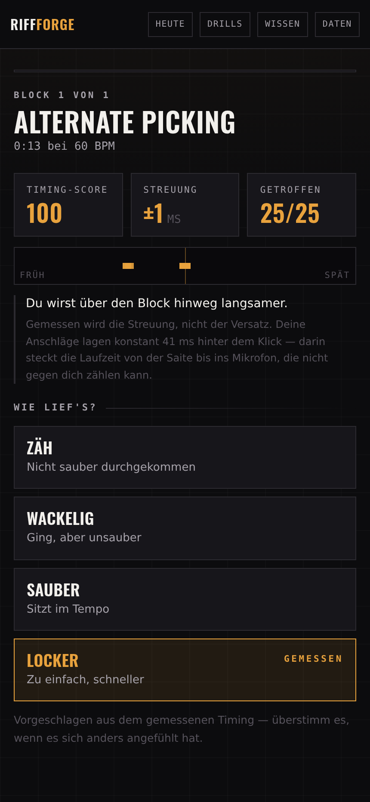
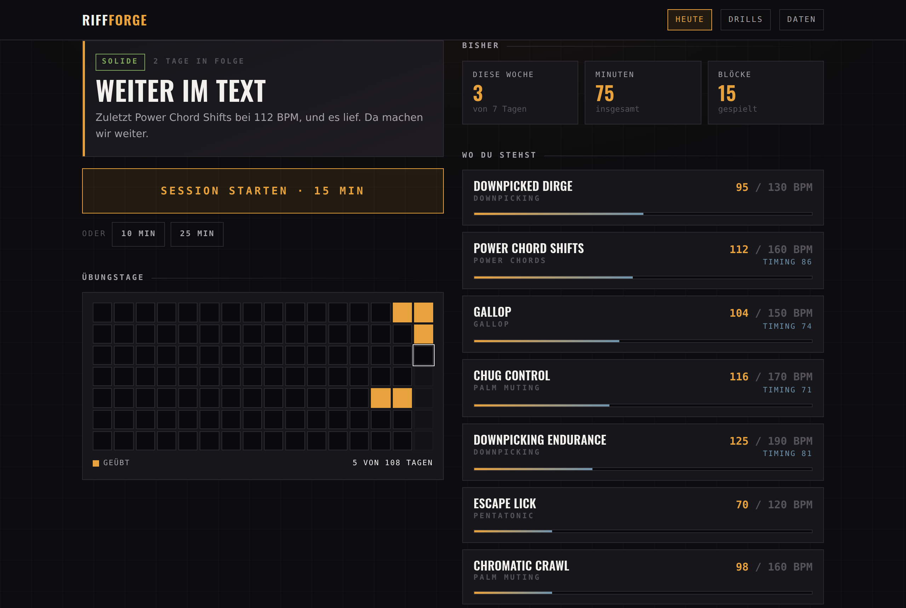
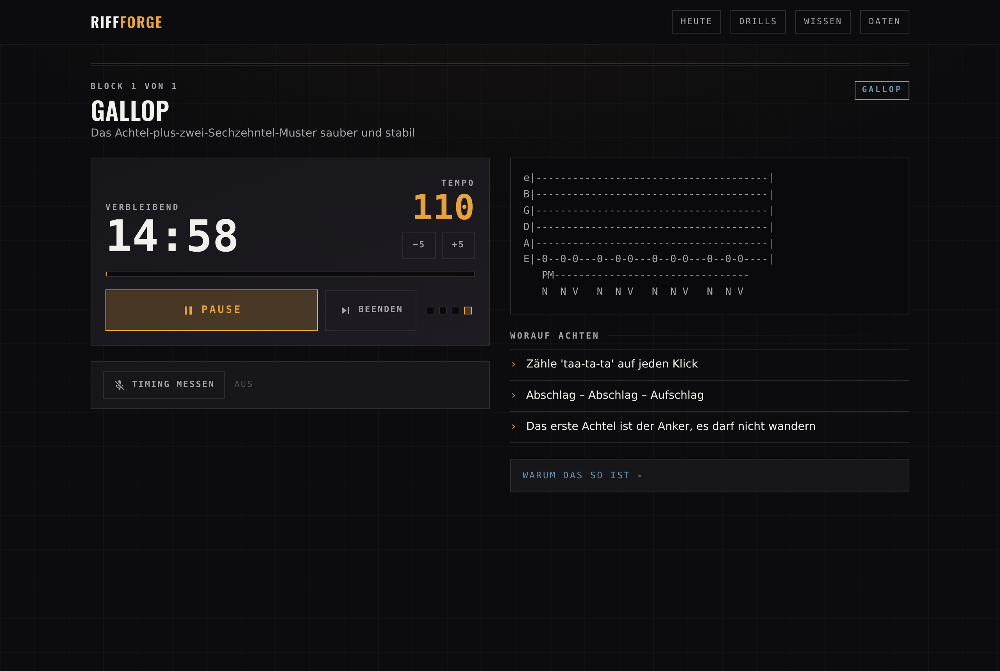
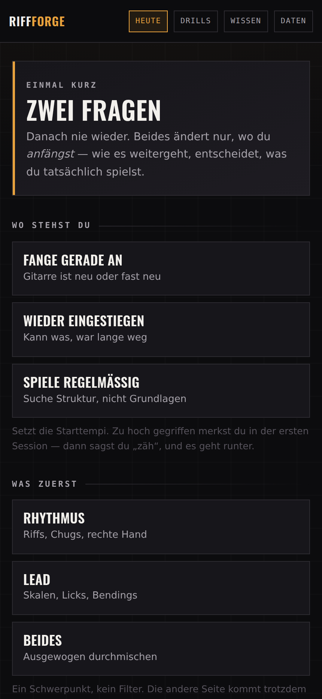

<p align="center">
  
</p>

<p align="center">
  <a href="https://cyphomat.github.io/riffforge/"></a>
  
  
  
</p>

<p align="center">
  <b>Eine Übungs-App für eine Person.</b><br>
  Kein Kurskatalog, eine Werkbank. Starten, fünfzehn Minuten spielen, fertig — morgen wieder.
</p>

<p align="center">
  <sub>100% vibe coded. Nutzung auf eigene Gefahr. Featurewünsche gerne gesehen.</sub>
</p>

<p align="center">
  <b>Deutsch</b> · <a href="README.en.md">English</a>
</p>

---

## So sieht es aus

<table>
<tr>
<td width="33%"></td>
<td width="33%"></td>
<td width="33%"></td>
</tr>
<tr>
<td align="center"><b>Die Ansage</b><br><sub>Was heute dran ist, und warum</sub></td>
<td align="center"><b>Im Block</b><br><sub>Uhr, Tempo, Tab, Metronom</sub></td>
<td align="center"><b>Danach</b><br><sub>Was das Mikrofon gehört hat</sub></td>
</tr>
</table>

**Auf dem Mac wird daraus eine Übersicht** — Ansage, Übungskalender, Kennzahlen
und Tempi nebeneinander statt untereinander:



**Und im Block liegen Uhr und Tab nebeneinander**, damit beim Spielen nichts
gescrollt werden muss:



<sub>Echte Bildschirme mit Beispieldaten, aufgenommen über <code>tools/shots.mjs</code>. Keine Mockups — die Timing-Werte oben stammen aus einer echten Messung.</sub>

---

## Beim ersten Start

<p align="center">
  
</p>

Zwei Fragen, danach nie wieder: **wo du stehst** und **was dich zuerst
interessiert**. Beide ändern etwas Echtes — die erste setzt die Starttempi
aller Drills, die zweite gewichtet, was zuerst drankommt.

Ein Schwerpunkt ist dabei kein Filter: wer Lead wählt, kommt trotzdem an die
rechte Hand, nur später. Und beides betrifft nur den *Anfang* — sobald ein Log
da ist, schreibt sich das Tempo daraus fort und die Antwort spielt keine Rolle
mehr.

## Wie eine Session abläuft

Immer dieselbe Form, damit sie keine Entscheidung kostet:

```
Warm-up    2 min    Finger wach kriegen
Technik    ~6 min   eine Sache isoliert, mit Metronom
Riff       ~6 min   dieselbe Technik im musikalischen Kontext
Abschluss           Selbsteinschätzung — landet im Log
```

Am Ende: **Feierabend** oder **+5 Minuten**. Die Form ist fix, der Inhalt passt
sich an.

## Was sie dir sagt

Der Unterschied zu einem Metronom mit Tab-Bildern: sie hat eine Meinung zum
heutigen Tag — aus dem Log, nicht aus dem Bauch.

- **Die Ansage** liest die letzte Session, die laufende Serie und die Pause davor
  und entscheidet zwischen `START`, `PAUSE`, `TECHNIK`, `SOLIDE` und `HART`. Jede
  Zeile ist im Log nachprüfbar:

  > **TECHNIK** — Heute sauber, nicht schnell.
  > *Gallop war zuletzt wackelig bei 95 BPM. Das Tempo bleibt, bis es sitzt.*

- **Ein wackeliger Block wiegt schwerer als drei saubere.** Was nicht sitzt,
  bestimmt den Ton — nicht der Durchschnitt.
- **Das Tempo schreibt sich fort.** Sauber durchgekommen heisst nächstes Mal
  schneller, gequält heisst langsamer. Wackelig heisst: dasselbe Tempo nochmal,
  denn genau dort passiert die Konsolidierung.
- **Was drankommt**, wählt der Scheduler nach zwei Kräften: was am schwächsten
  sitzt, und was am längsten her ist.
- **Ein Drill, den du kennst, kommt zweimal dran** — mit etwas anderem
  dazwischen. Das ist der [Kontextinterferenz-Effekt](https://www.ncbi.nlm.nih.gov/pmc/articles/PMC4989027/):
  verteilte Wiederholung behält sich messbar besser als eine lange am Stück,
  obwohl sie sich schlechter anfühlt. Ein **neuer** Drill bekommt seinen Block
  am Stück — beim Erlernen einer Bewegung ist das die bessere Reihenfolge.
- **Erst das Geschaffte, dann der Bericht.** Neue Bestwerte stehen nach der
  Session ganz oben.
- **Der Übungskalender** zeigt sechzehn Wochen am Stück. Bewusst nur geübt oder
  nicht, ohne Abstufung nach Minuten: eine Session ist per Konstruktion rund
  eine Viertelstunde: die Minuten pro Tag als Farbverlauf zu zeigen hiesse,
  Rauschen als Signal auszugeben. Was hier zählt, sind Serien und Lücken.

## Die Übungen

Dreizehn Stück. Das Tempo rechts ist Start → Ziel; wo du tatsächlich anfängst,
hängt an deiner Antwort beim ersten Start, und wie es weitergeht an dem, was du
spielst.

**Warm-up**

| Drill | Technik | Ziel | BPM |
|---|---|---|---|
| Chromatic 1-2-3-4 | — | Finger unabhängig machen und die Hand aufwärmen | 60 → 120 |
| String Skipping | — | Anschlaghand treffsicher machen, ohne hinzusehen | 60 → 130 |

**Technik**

| Drill | Technik | Ziel | BPM |
|---|---|---|---|
| Downpicking Endurance | Downpicking | Ausdauer im reinen Abschlag — der Kern des Thrash-Sounds | 90 → 190 |
| Chug Control | Palm Muting | Gleichmässige Palm Mutes — jeder Chug gleich laut, gleich kurz | 80 → 170 |
| Gallop | Gallop | Das Achtel-plus-zwei-Sechzehntel-Muster sauber und stabil | 70 → 150 |
| Power Chord Shifts | Power Chords | Lagenwechsel ohne Lücke und ohne Nebengeräusch | 70 → 160 |
| Alternate Picking | Alternate Picking | Gleichmässiger Wechselschlag auf einer Saite | 60 → 140 |
| Pentatonik Box 1 | Pentatonik | A-Moll-Pentatonik in der 5. Lage, hoch und runter | 60 → 150 |
| Bending & Vibrato | Bending | Ganztonziehen auf Tonhöhe treffen und halten | 50 → 100 |

**Riff**

| Drill | Technik | Ziel | BPM |
|---|---|---|---|
| Ironclad | Gallop | Gallop plus Lagenwechsel — das erste richtige Riff | 70 → 145 |
| Chromatic Crawl | Palm Muting | Offene Chugs gegen chromatische Zielnoten — Timing unter Druck | 80 → 160 |
| Downpicked Dirge | Downpicking | Langsam, schwer, alles Abschlag — Timing ohne Versteck | 60 → 130 |
| Escape Lick | Pentatonik | Erstes Lead-Lick: Pentatonik mit Bending am Ende | 55 → 120 |

Alles eigene Patterns im jeweiligen Stil — keine abgeschriebenen Tabs. Jeder
Drill bringt seine eigenen Cues mit und ein aufklappbares **Warum das so ist**,
das die Theorie dahinter in zwei Sätzen erklärt.

## Was das Mikrofon hört

Zuschaltbar in jedem Block. Sie hört **Anschläge, keine Tonhöhen** — bei
verzerrter Gitarre ist Pitch-Tracking unzuverlässig, Transienten dagegen sind
eindeutig, und für Rhythmusarbeit ist der Einsatzzeitpunkt ohnehin die ganze
Frage.

Zwei Zahlen, die man nicht verwechseln darf:

| | |
|---|---|
| **Streuung** | Wie gleichmässig du bist. **Das** ist die Spielqualität, darauf baut der Score. |
| **Versatz** | Der konstante Abstand zum Klick. Steckt voller Laufzeit — Saite → Luft → Mikrofon → Puffer. Zählt **nicht** gegen dich. |

Der Versatz wird geschätzt, **bevor** zugeordnet wird. Ohne diesen Schritt
verfehlt bei Bluetooth-Kopfhörern (150–300 ms Latenz) jeder Ton seinen Klick,
und die Messung liest sich still als „nichts gehört".

Ein **negativer** Versatz ist übrigens kein Latenz-Artefakt: Laufzeit kann einen
Ton nur später machen, nie früher. Wer vorne liegt, spielt wirklich vorne — und
das sagt sie dann auch so.

Danach schlägt sie die Einschätzung selbst vor. Du kannst sie überstimmen.

> **Kopfhörer benutzen.** Über Lautsprecher hört das Mikrofon das Metronom mit
> und zählt es als Anschlag.

Es wird nichts aufgenommen und nichts hochgeladen — nur der Zeitpunkt jedes
Anschlags ausgewertet.

---

## Als App installieren

**iPhone / iPad** — in **Safari** öffnen (Chrome auf iOS kann das nicht),
Teilen → *Zum Home-Bildschirm*.

**Mac** — Safari 17+: *Ablage → Zum Dock hinzufügen*. In Chrome: Symbol in der
Adressleiste → *Installieren*.

Danach startet sie ohne Browserleiste, hat ein eigenes Icon und **läuft
offline** — nach dem ersten Aufruf liegt alles im Cache, eine Session braucht
kein Netz mehr.

Installieren lohnt auch aus einem weniger offensichtlichen Grund: Safari räumt
den Speicher normaler Webseiten nach sieben Tagen ohne Besuch auf. Für
Home-Screen-Apps gilt das nicht — dein Übungs-Log überlebt also nur, wenn du
sie wirklich installierst.

### Zwei iOS-Eigenheiten

- **Der Klingelschalter muss an sein.** iOS schaltet Web-Audio stumm, wenn das
  Gerät auf lautlos steht — das Metronom bleibt still, ohne Fehlermeldung. Das
  ist eine iOS-Eigenheit, kein Fehler der App.
- **Mikrofon braucht iOS 14.3 oder neuer.** Davor gab Safari im
  Home-Screen-Modus keinen Mikrofonzugriff frei.

## Daten

Der Übungsfortschritt liegt in `localStorage` auf dem Gerät. Kein Konto, kein
Server — solange du nichts anderes einrichtest, verlässt nichts den Browser.

Unter **Daten** holst du ihn als JSON heraus und wieder herein. Ein Import
**legt dazu, statt zu ersetzen**: Einträge sind unveränderlich und tragen Drill
und Zeitstempel, also ist die Vereinigung beider Seiten die richtige Antwort —
zwei Geräte, die unabhängig geübt haben, haben beide recht. Vor dem Übernehmen
zeigt die App, wie viel davon wirklich neu ist.

### Abgleich zwischen Geräten

Dort lässt sich auch ein **privates Datenrepo** verbinden. Die App legt den Log
dann zusätzlich als eine Datei dorthin, und iPhone und Mac ziehen sich
gegenseitig nach — nach jeder Session automatisch, oder von Hand.

Es gewinnt dabei keine Seite. Beim Schreibkonflikt wird neu gelesen, erneut
verschmolzen und noch einmal geschrieben; dieselbe Vereinigung wie beim Import.
Ein Abgleich ohne Neuigkeiten erzeugt keinen Commit.

Was du brauchst: ein privates Repo (etwa `riffforge-data`) und einen
**fein granulierten** Token, der ausschliesslich darauf zeigt, mit
*Contents: Read and write*. Eng gefasst aus einem konkreten Grund — alle Seiten
unter `github.io` teilen sich denselben Browser-Speicher, und ein Token, der
nur ein Datenrepo öffnen kann, begrenzt den Schaden, falls irgendeine dieser
Seiten einmal eine Lücke hat.

Steht das Datenrepo auf öffentlich, sagt die App das deutlich: sie funktioniert
dann genauso, nur liest jeder mit.

### Löschen heisst löschen

**Alles löschen** unter *Daten* räumt den Log, eine eventuell beiseitegelegte
Kopie davon und die beiden Antworten vom ersten Start weg. Danach ist die App
wieder wie frisch installiert. **Trennen** löscht Konto, Repo und Token aus dem
Browser-Speicher.

### Was die App nicht tut

Keine Analyse-Dienste, keine Schriften von fremden Servern, keine Einbettungen —
nachgemessen, nicht behauptet: beim Laden aller Seiten und einer vollständigen
Session geht **keine einzige Anfrage** an einen anderen Host. Der einzige
mögliche Netzzugriff ist `api.github.com`, und den gibt es nur, wenn du den
Abgleich selbst eingerichtet hast.

Das Mikrofon verlässt den Rechner nicht: der Audio-Thread meldet ausschliesslich
**Zeitstempel und einen Pegelwert** nach vorne, kein Ton wird aufgenommen,
gespeichert oder verschickt. Nach jedem Block wird die Aufnahme wieder
freigegeben.

Weil auf GitHub Pages keine eigenen Kopfzeilen gehen, steht die
Content-Security-Policy als Meta-Tag in der Seite. Der wichtige Teil ist
`connect-src`: Anfragen dürfen nur an die eigene Adresse und an GitHub gehen.
Käme über irgendeinen Weg fremdes Skript in die Seite, könnte es Token und Log
nirgendwohin schicken.

---

## Entwicklung

```bash
pnpm install
pnpm dev          # http://localhost:3000
```

```bash
pnpm test         # Vitest — die Logik in lib/session und lib/audio
pnpm check        # Typen, Tests und Lint in einem Rutsch
pnpm build        # statischer Export nach out/
```

Die Logik in `lib/session/` und `lib/audio/timing.ts` ist rein: kein React,
keine Browser-APIs. Deshalb ist sie testbar, und deshalb liegen dort die Tests.
Neue Regeln zu Tempo, Auswahl oder Bewertung gehören dorthin, nicht in eine
Komponente.

Das Mikrofon braucht einen sicheren Kontext. `localhost` zählt als sicher, die
IP im Heimnetz **nicht** — zum Testen auf dem Handy also über die
veröffentlichte Seite gehen, nicht über `http://192.168.…`.

Neue Bildschirme für diese Seite:

```bash
pnpm build && (cd out && python3 -m http.server 3100 &)
node tools/shots.mjs
```

Architektur und Konventionen stehen in [CLAUDE.md](./CLAUDE.md).

## Deployment

Push auf `main` → GitHub Actions baut den statischen Export und veröffentlicht
ihn auf GitHub Pages ([`.github/workflows/pages.yml`](.github/workflows/pages.yml)).
Der Workflow lässt nichts durch, was `pnpm check` reisst.

Pages liefert unter `/<repo>/` aus, deshalb setzt der Workflow
`NEXT_PUBLIC_BASE_PATH`. Pfade, die zur Laufzeit entstehen — das Audio-Worklet,
der Service Worker — müssen durch `asset()` aus `lib/base-path.ts`, sonst
greifen sie im Unterverzeichnis daneben.

## Inhalte

Alle Drills und Riffs sind **eigene** Übungen im jeweiligen Stil. Keine
abgeschriebenen Tabs, kein Audio urheberrechtlich geschützter Aufnahmen.

## Was noch kommt

- **Stimmgerät.** Autokorrelation reicht dafür, und man braucht es vor jeder
  Session ohnehin.
- **Kalibrierung**: den Versatz einmal messen und behalten, statt ihn pro Block
  neu zu schätzen. `AudioContext.outputLatency` gäbe es dafür — nur Safari
  liefert es nicht, weder auf dem Mac noch auf dem iPhone.
- **Der iOS-Klingelschalter.** Es gibt einen bekannten Kniff, um Web-Audio
  trotz Stummschaltung klingen zu lassen. Ungetestet, deshalb noch nicht drin.

## Danke

Design-Sprache, Ton und die Idee der Ansage kommen von
[Setlist](https://github.com/cyphomat/setlist) — dem Schwesterprojekt fürs
Training. Kein Neon: ein Röhrenamp glimmt, er strahlt nicht.
